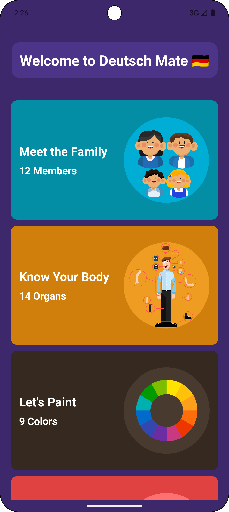
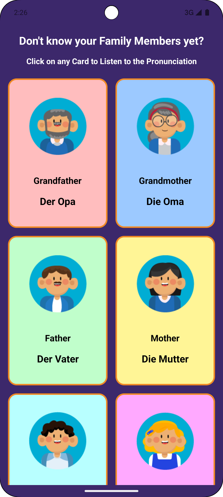

# DeutschMate

## Project Overview
**DeutschMate** is an educational mobile application designed to help users learn German vocabulary in an engaging and interactive way. It features five categories: **Family Members, Jobs, Numbers, Colors, and Body Parts.** Each category contains cards with German words, and users can tap on any card to hear the correct pronunciation of the word.

This app is developed using **Android Java**, focusing on simplicity and user-friendly navigation to provide a seamless learning experience.

---

## Features
- **Five Vocabulary Categories**
    - Family Members
    - Jobs
    - Numbers
    - Colors
    - Body Parts

- **Audio Pronunciation**
    - Tap any card to hear the correct pronunciation of the German word.

- **Interactive UI**
    - Simple and intuitive card-based layout to enhance learning and engagement.

---

## Future Enhancements
- **Additional Categories:** Expand the vocabulary set with new categories like verbs and phrases.
- **Quiz Mode:** Add interactive quizzes to test vocabulary knowledge.
- **Favorites List:** Allow users to save favorite words for quick reference.

---

## Technologies Used
- **Android Studio** for development
- **Java** for backend logic
- **MediaPlayer API** for audio playback

---

## How to Run the Project
1. Clone this repository to your local machine.
2. Open the project in Android Studio.
3. Connect a physical Android device or use an emulator.
4. Build and run the project.

---

## Screenshots
- **Home Screen**  
  
  _Showcase of categories available._

- **Category Screen**
   
  _Words displayed in interactive cards._

---

## Purpose
This app was developed as part of an Android Java project to demonstrate mobile app development skills and provide a fun, educational tool for German language learners.  
